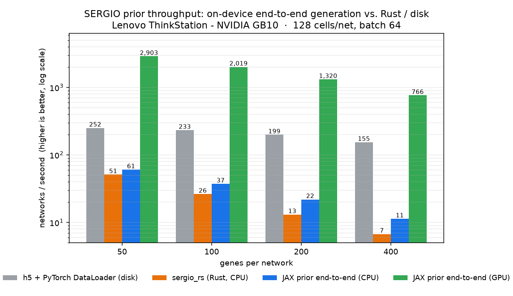

<h1 align="center">cell-priors</h1>

Efficient and diverse virtual-cell priors in JAX for end-to-end pretraining.

Features include:

- swappable **GRN sampler × simulator** priors behind one uniform interface;
- GRN samplers (grouped scale-free) and expression simulators (SERGIO's Hill-function
  SDE, the grn-paper sigmoid-link SDE) — faithful JAX reimplementations, each validated
  numerically against the original;
- `jit`/`vmap`/`scan`-able everything — the prior and model fuse into one computation
  graph on the GPU, with no host round-trip;
- a PyTree of arrays as parameters, and every sampling/simulation method a pure function
  of `(params, key)`;
- hard knockouts and soft CRISPRi knockdowns under a common intervention API;
- MapPFN-format `.h5ad` export, plus speed benchmarks and distributional comparison
  against real datasets.



Generating fresh SERGIO networks on the GPU (batched, fused into the training graph)
reaches **~2,000–3,400 networks/s** — roughly **20–60× faster than the same JAX core on
CPU**, **50–300× the Rust `sergio_rs` reference**, and faster than even *loading*
precomputed data from disk through a PyTorch `DataLoader`. Same model, four backends;
measured on a Lenovo ThinkStation (NVIDIA GB10). Reproduce with
`python -m cell_priors.eval.throughput` (see [Benchmarks](#benchmarks--comparison-scripts-not-notebooks)).

Currently included:

| samplers / simulators | implements | reimplemented in JAX from |
|---|---|---|
| **`GroupedScaleFreeSampler`** | grouped scale-free directed graph | grn-paper (Aguirre et al. 2025) |
| **`SergioSimulator`** | Hill-function SDE, multi-cell-type, technical noise | [SERGIO]; validated vs. [`sergio_rs`] |
| **`GrnPaperSimulator`** | sigmoid-link SDE, time-averaged observation | grn-paper (Aguirre et al. 2025) |

Plus a preconfigured prior:

- **`MapPfnPrior`** — grouped scale-free sampler × a *cycle-tolerant* SERGIO. Less
  opinionated than the strict SERGIO prior: it simulates any sampled GRN exactly as drawn
  (cycles kept) and gives every gene a basal production rate, so it does **not** require a
  DAG or master regulators.

[SERGIO]: https://github.com/PayamDibaeinia/SERGIO
[`sergio_rs`]: https://github.com/rainx0r/sergio_rs
[grn-paper]: https://github.com/maguirre1/grn-paper

---

## Quickstart

```python
import jax
from cell_priors import ComposedPrior, InterventionKind, MapPfnPrior
from cell_priors.samplers import GroupedScaleFreeSampler
from cell_priors.simulators.sergio import SergioSimulator, SergioConfig
from cell_priors.simulators.grn_paper import GrnPaperSimulator, GrnPaperConfig

sampler = GroupedScaleFreeSampler(r=4.0, num_groups=3, kappa=10.0)

# Same sampler, different simulators — interchangeable priors:
sergio = ComposedPrior(sampler, SergioSimulator(SergioConfig(num_cells=200, num_cell_types=2)))
grnp   = ComposedPrior(sampler, GrnPaperSimulator(GrnPaperConfig(num_cells=200)))
mappfn = MapPfnPrior(SergioConfig(num_cells=200), sampler=sampler)  # cycle-tolerant SERGIO

params = sergio.sample_params(jax.random.PRNGKey(0), num_genes=100)   # sample GRN + kinetics
obs    = sergio.observational(params, jax.random.PRNGKey(1))          # (cells, genes)

# Intervene on gene 7 and sample the perturbed distribution
ko = sergio.interventional(params, jax.random.PRNGKey(2), [7], kind=InterventionKind.KNOCKOUT)
kd = sergio.interventional(params, jax.random.PRNGKey(2), [7],
                           kind=InterventionKind.KNOCKDOWN, strength=0.5)
```

Because the methods are pure functions of `(params, key)`, the prior fuses with a model
in one compiled graph:

```python
@jax.jit
def step(model, key):
    expr = prior.observational(params, key)   # simulated on-device
    return loss_fn(model, expr)               # model trains on it, same graph
```

---

## The interfaces

`cell_priors.base` defines the contract (see also `ComposedPrior`, which wires them
together):

- **`GRN`** — a sampled structure: sparse directed edges `(reg, tar)` with integer
  `weight` (multiplicity) and a per-gene `group` label. Simulator-agnostic.
- **`GRNSampler.sample(key, num_genes) -> GRN`**.
- **`Simulator`** — `build_params(grn, key)` attaches kinetic parameters; `simulate(params,
  key)` integrates the expression model; `intervene(params, genes, kind, strength)` edits
  params. Each simulator owns its parametrization and intervention semantics.
- **`Prior`** — `sample_params` / `observational` / `intervene` / `interventional`.

### GRN samplers

**`GroupedScaleFreeSampler`** is a JAX reimplementation of the grn-paper
`grouped_scale_free_graph`: Bollobás-style directed preferential attachment with three
moves (`alpha`/`beta`/`gamma`) plus `k` modules and within-group attachment (`kappa`).
Parametrize by `r` (avg. regulators per gene). Preferential attachment is inherently
sequential, so structure growth is a host-driven loop using `jax.random`; the heavy
numerics live in the simulators, which are fully `jit`/`vmap`-able.

### Simulators

**`SergioSimulator`** — SERGIO's Hill-function SDE. Each gene's production is a sum of
Hill terms over its regulators (activation/repression); master regulators have a fixed
basal rate per cell type. Engineered for the prior+model loop:

- **Sparse edge list, not dense adjacency** → each step is `O(E · C)` via one
  `segment_sum` (`E` edges, `C` cell types), not `O(G² · C)`.
- **The expensive init is a fixed point, not a graph walk.** SERGIO's per-edge
  half-response and steady-state estimate (a sequential pass over topological levels) is
  recast as a `lax.scan` fixed point that converges to the *exact* same values on a DAG.
- **One `lax.scan`** for the whole SDE; the trajectory is sampled with a gather.
- A sampled `GRN` is cyclic in general, so the SERGIO adapter breaks cycles (drops the
  weakest edge per cycle) before simulating — *unless* you opt into the cycle-tolerant
  mode (`SergioConfig(require_mrs=False)` + `SergioSimulator(..., acyclic=False)`, as used
  by `MapPfnPrior`), which keeps every edge and gives every gene a basal production rate
  so any GRN — cyclic, with no source nodes — is still driven.

**`GrnPaperSimulator`** — the grn-paper model: a sigmoid-link SDE on a dense signed
interaction matrix `β` with per-gene basal `α` and degradation `l`,

```
X(t+dt) = X(t) + dt·(σ(α + Xβ) − l·X) + s·√(dt·X)·N(0,1),   clipped at 0,
```

where each cell is an independent realization observed as its post-burn-in time average.
The integration is a single `lax.scan` that accumulates the running mean (no stored
trajectory).

### Numerically validated

- **SERGIO vs. `sergio_rs`:** with `noise_s = 0` the SDE is deterministic; the suite runs
  `sergio_rs` to its fixed point, recovers the master-regulator rates from the converged
  state, feeds them into the JAX core, and asserts every gene matches (`max abs diff <
  1e-3` across DAGs/seeds) — exercising the Hill function, the half-response/steady-state
  estimate, and the integration together.
- **grn-paper vs. reference:** the JAX core matches a direct transcription of
  `simulate_rna` (deterministic `s = 0`) to float precision.

```bash
uv run pytest          # 29 tests, incl. sergio_rs + grn-paper parity
```

### Hard knockouts vs. soft CRISPRi knockdowns

Both simulators support two perturbation styles so you can compare them directly:

| | hard `KNOCKOUT` | soft `KNOCKDOWN` (CRISPRi-like) |
|---|---|---|
| **SERGIO** | remove the gene + its outgoing edges; orphaned targets become master regulators | scale the gene's production by `1 − strength`; graph intact |
| **grn-paper** | zero the gene's outgoing interactions | attenuate the gene's outgoing interactions by `strength` |

At `strength = 1` a knockdown silences the gene's output, but unlike a knockout the graph
structure is preserved — the principled difference between ablating a node and dialing
down its transcription.

---

## Install

Uses [uv](https://docs.astral.sh/uv/). Python 3.12.

```bash
uv sync                # CPU JAX + everything needed for tests/benchmarks
uv sync --extra cuda   # add GPU JAX (jax[cuda12])
```

`sergio_rs` is pulled as a prebuilt wheel (x86_64 / aarch64). A ready-to-use dev
container lives in `.devcontainer/`, and GitHub Actions build & publish it to GHCR on
version tags.

---

## Generate datasets (MapPFN `.h5ad` format)

```python
from cell_priors.io import generate_anndata, write_h5ad

adata = generate_anndata(sergio, jax.random.PRNGKey(0),
                         num_contexts=8, num_genes=100, add_noise=True)
write_h5ad(adata, "sergio.h5ad")
```

Output matches MapPFN: `adata.X` is counts `(cells, genes)`, `adata.var_names` are
`GENE0000…`, and `adata.obs` has `context` (GRN id) and `treatment` (perturbed gene id or
`"control"`). Technical noise (outlier / library-size / dropout / UMI) uses the SERGIO
paper's DS1–DS14 profiles and is shared by both simulators.

---

## Benchmarks & comparison (scripts, not notebooks)

**Prior speed — JAX vs. `sergio_rs`, across dimensionalities:**

```bash
uv run python -m cell_priors.eval.benchmark_speed --genes 20,50,100,200 --cells 200
uv run python -m cell_priors.eval.benchmark_speed --genes 100 --batch 16        # vmapped
uv run python -m cell_priors.eval.benchmark_speed --simulator grn_paper --genes 50,100
uv run python -m cell_priors.eval.benchmark_speed --simulator mappfn --genes 50,100
```

**End-to-end prior + model in one graph (throughput):**

```bash
uv run python -m cell_priors.eval.benchmark_e2e --genes 50 --batch 8 --steps 50
uv run python -m cell_priors.eval.benchmark_e2e --simulator grn_paper --genes 50
```

Each step samples a fresh batch of networks from the prior, simulates them, feeds the
expression into a small permutation-invariant JAX model, and backprops the model — all
inside a single `jit`, no host transfer.

**Throughput across backends (the figure at the top):**

```bash
# CPU variants (sergio_rs + JAX-CPU + h5/PyTorch loader), then GPU, then plot
JAX_PLATFORMS=cpu CUDA_VISIBLE_DEVICES= uv run python -m cell_priors.eval.throughput measure --out throughput.json --extras
XLA_PYTHON_CLIENT_PREALLOCATE=false uv run python -m cell_priors.eval.throughput measure --out throughput.json
uv run python -m cell_priors.eval.throughput plot --data throughput.json --out assets/throughput.png --device "my machine"
```

`XLA_PYTHON_CLIENT_PREALLOCATE=false` keeps JAX from grabbing most of GPU memory up front
(important on the GB10's unified memory, and when sharing the GPU).

**Compare distributions, DE genes, and real data:**

```bash
uv run python -m cell_priors.eval.compare stats sergio                       # health / sparsity
uv run python -m cell_priors.eval.compare de sergio --gene 0                 # DE vs control (scanpy)
uv run python -m cell_priors.eval.compare distribution sergio grn_paper      # prior vs prior
uv run python -m cell_priors.eval.compare distribution sergio hf:marvinsxtr/MapPFN/frangieh.h5ad
```

A *source* is a prior name (`sergio`, `grn_paper`), a local `.h5ad` path, or
`hf:<repo>/<file>` to pull from a Hugging Face dataset (e.g. the real
[`marvinsxtr/MapPFN`](https://huggingface.co/datasets/marvinsxtr/MapPFN) datasets:
`frangieh.h5ad`, `papalexi.h5ad`, `sergio.h5ad`). Distributional comparison reports KS and
Wasserstein distances and writes a figure.

---

## Utilities

```python
from cell_priors.utils import summarize, assert_healthy            # sparsity / NaN / dead-gene checks
from cell_priors.utils import infer_grn_correlation, infer_grn_regression, edge_auroc
```

- **Diagnostics** (`utils.stats`): one-call health/sparsity summary, per-gene moments,
  `assert_healthy` for pipelines.
- **GRN inference** (`utils.grn_infer`): marginal-correlation and GENIE3-style Lasso edge
  scorers plus edge-recovery AUROC — for generating *comparable* synthetic data (infer a
  GRN from real data, re-simulate it) and for controllable overfitting experiments.

---

## Project layout

```
src/cell_priors/
  base.py                       # GRN, GRNSampler, Simulator, Prior, ComposedPrior
  samplers/
    grouped_scale_free.py       # grn-paper grouped scale-free sampler (JAX)
  simulators/
    sergio/                     # SERGIO simulator
      core.py                   #   Hill, fixed-point init, scan SDE loop
      params.py                 #   SergioParams pytree, config
      adapter.py                #   GRN -> DAG -> SergioParams (+ kinetics)
      noise.py                  #   technical noise (DS1–DS14)
      interventions.py          #   hard knockout / soft knockdown
      simulator.py              #   SergioSimulator
    grn_paper/                  # grn-paper sigmoid-SDE simulator
      core.py                   #   SDE + interventions
      simulator.py              #   GrnPaperSimulator + GRN -> params adapter
  io/h5ad.py                    # MapPFN-format AnnData export
  utils/                        # GRN inference + diagnostics
  eval/                         # benchmark_speed, benchmark_e2e, compare
tests/                          # parity (sergio_rs, grn-paper), sampler, interface, ...
.devcontainer/  .github/workflows/
```

---

## Citation

If you use this repository, please cite it together with the simulators and sampler it
builds on:

```bibtex
@software{sextro_cell_priors_2026,
  author  = {Sextro, Marvin},
  title   = {{cell-priors}: Efficient and diverse virtual-cell priors in {JAX} for end-to-end pretraining},
  year    = {2026},
  url     = {https://github.com/marvinsxtr/cell-priors}
}
```

## References

This work reimplements and builds on the SERGIO simulator, its Rust port `sergio_rs`, and
the grn-paper grouped scale-free GRN model.

```bibtex
@article{dibaeinia_sergio_2020,
  title   = {{SERGIO}: {A} {Single}-{Cell} {Expression} {Simulator} {Guided} by {Gene} {Regulatory} {Networks}},
  volume  = {11},
  number  = {3},
  journal = {Cell Systems},
  author  = {Dibaeinia, Payam and Sinha, Saurabh},
  year    = {2020},
  pages   = {252--271}
}

@software{Chatzaroulas_sergio_rs_The_SERGIO_2024,
  author  = {Chatzaroulas, Evangelos},
  title   = {{sergio\_rs}: The {SERGIO} v2 simulator rewritten in {Rust}},
  version = {0.2.2},
  year    = {2024},
  url     = {https://github.com/rainx0r/sergio_rs}
}

@article{aguirre_gene_2025,
  title   = {Gene regulatory network structure informs the distribution of perturbation effects},
  volume  = {21},
  number  = {9},
  journal = {PLOS Computational Biology},
  author  = {Aguirre, Matthew and Spence, Jeffrey P. and Sella, Guy and Pritchard, Jonathan K.},
  year    = {2025},
  pages   = {1--31}
}
```

## License

[MIT](LICENSE) © 2026 Marvin Sextro. This is an independent JAX reimplementation;
see the upstream SERGIO, `sergio_rs` and grn-paper projects for the original work.
